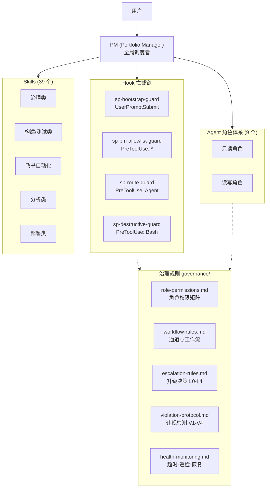
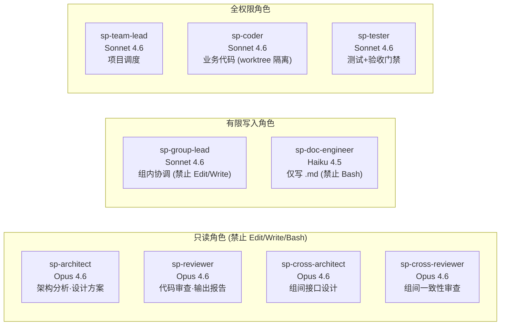
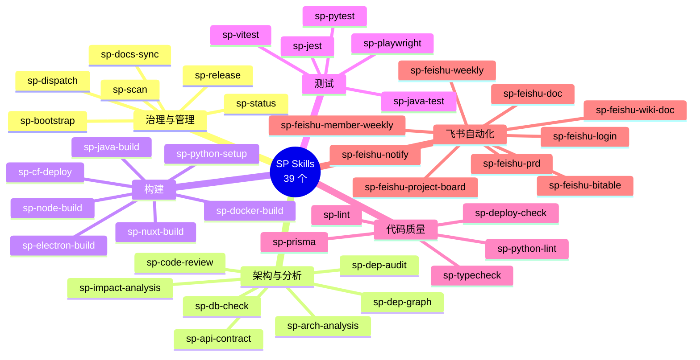
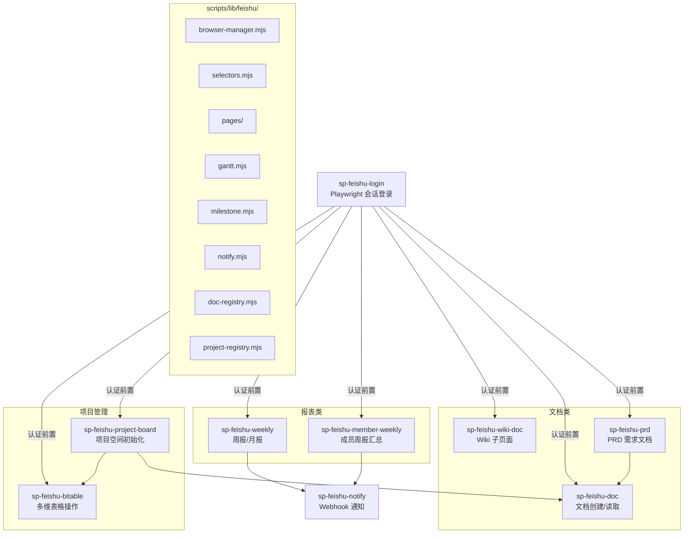
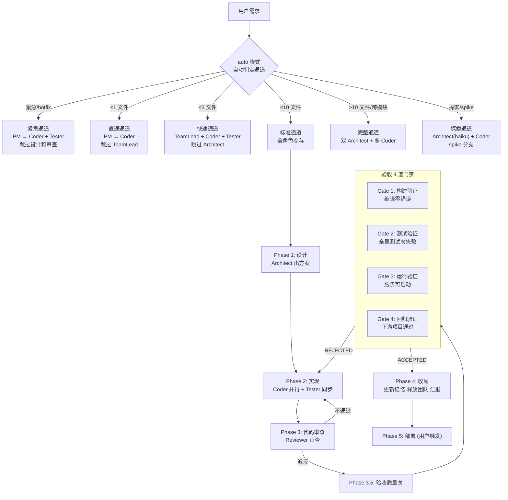
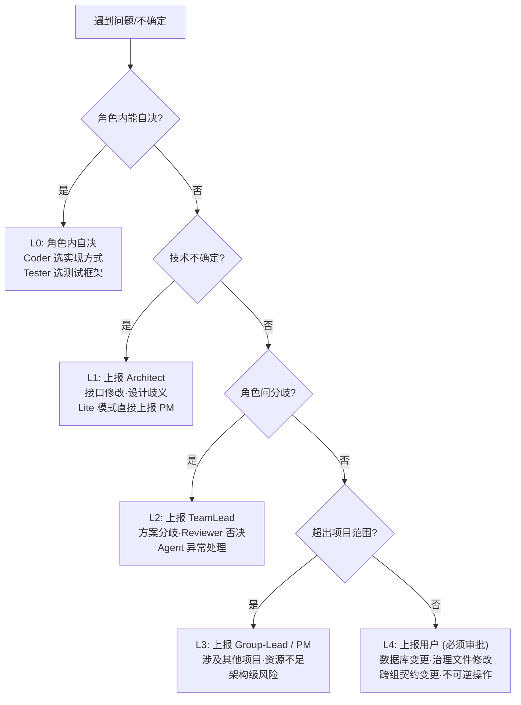
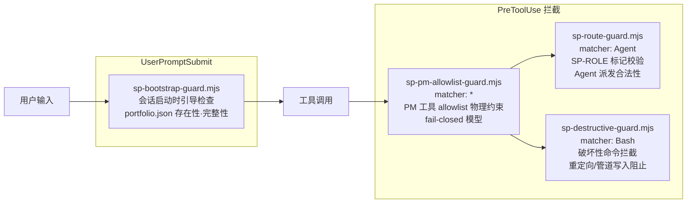
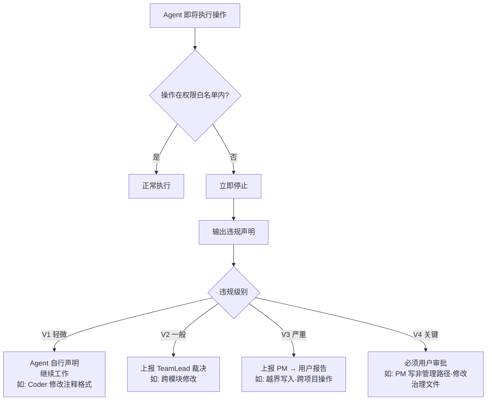
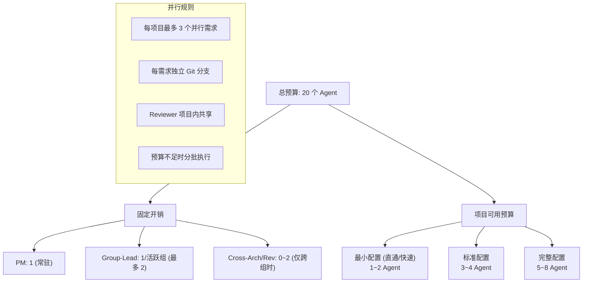

# SP Governance v7.3.0 — 完整能力与技能全景图

> 基于项目实际文件和配置生成，反映 sp-governance 插件的真实能力状态。
>
> 生成日期: 2026-04-02

---

## 一、架构总览



---

## 二、Agent 角色体系



### Agent 详细清单

| Agent | 模型 | 定位 | 物理约束 (disallowedTools) |
|-------|------|------|---------------------------|
| `sp-architect` | claude-opus-4-6 | 只读分析，设计方案 | Edit, Write, Bash, NotebookEdit |
| `sp-reviewer` | claude-opus-4-6 | 只读审查，输出报告 | Edit, Write, Bash, NotebookEdit |
| `sp-cross-architect` | claude-opus-4-6 | 组间接口设计 | Edit, Write, Bash, NotebookEdit |
| `sp-cross-reviewer` | claude-opus-4-6 | 组间一致性审查 | Edit, Write, Bash, NotebookEdit |
| `sp-group-lead` | claude-sonnet-4-6 | 组内协调 | NotebookEdit; prompt 约束仅 groups/ 下文档 |
| `sp-doc-engineer` | claude-haiku-4-5 | 仅写 .md 文档 | Bash; prompt 约束仅 .md 文件 |
| `sp-team-lead` | claude-sonnet-4-6 | 项目调度 | 无; 管理操作自主，代码操作派发给 Coder |
| `sp-coder` | claude-sonnet-4-6 | 业务代码实现 | 无; worktree 隔离，限本项目 |
| `sp-tester` | claude-sonnet-4-6 | 测试编写 + 验收门禁 | 无; prompt 约束限测试文件 |

---

## 三、Skill 分类全景图



### Skill 完整清单

#### 治理与管理 (6 个)

| Skill | 名称 | 说明 |
|-------|------|------|
| `sp-bootstrap` | 治理诊断 | 完整 SP 治理诊断 — agents、governance 文件、项目目录、漂移检测 |
| `sp-status` | 状态查看 | 快速查看 SP 治理状态 — portfolio 摘要、分组、上次诊断 |
| `sp-scan` | 漂移扫描 | 扫描工作区项目漂移 — 检测新增、删除、变更的项目 |
| `sp-dispatch` | 任务派发 | 快速将任务派发到项目，自动选择正确的 SP agent |
| `sp-release` | 插件发布 | SP governance 插件发布流程 — 版本号、打包、安装、注册 |
| `sp-docs-sync` | 文档同步 | 检查 git 状态，提交并推送 SP 管理项目的文档变更 |

#### 架构与分析 (7 个)

| Skill | 名称 | 说明 |
|-------|------|------|
| `sp-arch-analysis` | 架构分析 | 项目架构分析 |
| `sp-api-contract` | 接口契约 | 跨项目接口契约检查 |
| `sp-dep-graph` | 依赖关系图 | 项目间依赖关系图 |
| `sp-dep-audit` | 依赖审计 | 依赖安全审计 |
| `sp-impact-analysis` | 影响分析 | 变更影响分析 |
| `sp-db-check` | 数据库检查 | 数据库配置与 SQL 分析 |
| `sp-code-review` | 代码审查 | 代码审查 |

#### 构建 (5 个)

| Skill | 名称 | 说明 |
|-------|------|------|
| `sp-node-build` | Node 构建 | Node.js 项目构建 |
| `sp-java-build` | Java 构建 | Maven 构建 Java 项目 |
| `sp-nuxt-build` | Nuxt 构建 | Nuxt3 官网静态生成 |
| `sp-docker-build` | Docker 构建 | Docker 镜像构建 |
| `sp-electron-build` | Electron 打包 | Electron 应用打包 |

#### 测试 (5 个)

| Skill | 名称 | 说明 |
|-------|------|------|
| `sp-jest` | Jest 测试 | Jest 单元测试 |
| `sp-vitest` | Vitest 测试 | Vitest 单元测试 |
| `sp-pytest` | Pytest 测试 | Pytest 测试执行 |
| `sp-java-test` | Java 测试 | Maven 单元测试执行 |
| `sp-playwright` | E2E 测试 | Playwright E2E 端到端测试 |

#### 代码质量与部署 (5 个)

| Skill | 名称 | 说明 |
|-------|------|------|
| `sp-lint` | 代码规范 | 多项目代码规范检查 |
| `sp-python-lint` | Python 规范 | Python 代码规范检查 |
| `sp-typecheck` | 类型检查 | TypeScript 类型检查 |
| `sp-prisma` | Prisma ORM | Prisma ORM 操作 |
| `sp-deploy-check` | 部署检查 | 部署前综合检查 |

#### 环境与配置 (2 个)

| Skill | 名称 | 说明 |
|-------|------|------|
| `sp-python-setup` | Python 环境 | Python 环境安装配置 |
| `sp-cf-deploy` | CF 部署 | Cloudflare Pages 部署 |

#### 飞书自动化 (9 个)

| Skill | 名称 | 说明 |
|-------|------|------|
| `sp-feishu-login` | 飞书登录 | 飞书会话登录，保存 Playwright session |
| `sp-feishu-doc` | 飞书文档 | 飞书文档创建和读取 |
| `sp-feishu-wiki-doc` | Wiki 文档 | 在飞书 Wiki 中创建子页面（支持去重管理） |
| `sp-feishu-prd` | PRD 文档 | 生成 PRD 产品需求文档并可选推送到飞书 |
| `sp-feishu-weekly` | 周报/月报 | 生成周报/月报文档 |
| `sp-feishu-member-weekly` | 成员周报 | 汇总成员个人周报 |
| `sp-feishu-project-board` | 项目看板 | 创建飞书项目空间（文档+多维表格+甘特图） |
| `sp-feishu-bitable` | 多维表格 | 飞书多维表格操作（创建/更新/查询） |
| `sp-feishu-notify` | 飞书通知 | 通过飞书 Webhook 发送通知 |

---

## 四、飞书自动化流程图



### 飞书依赖

- `playwright ^1.50.0` — 浏览器自动化
- `marked ^15.0.0` — Markdown 解析
- `turndown ^7.0.0` — HTML 转 Markdown
- 认证数据: `<workspace>/auth/`
- 项目注册: `<workspace>/config/projects.json`
- 配置模板: `config/feishu-config.example.json`

---

## 五、标准工作流



---

## 六、升级决策树



---

## 七、Hook 拦截链



### Hook 详情

| Hook | 触发时机 | Matcher | 功能 |
|------|----------|---------|------|
| `sp-bootstrap-guard` | UserPromptSubmit | `*` | 会话启动引导检查，验证 portfolio.json |
| `sp-pm-allowlist-guard` | PreToolUse | `*` | PM 工具白名单物理约束，fail-closed 模型，子 agent 自动豁免 |
| `sp-route-guard` | PreToolUse | `Agent` | 校验 `[SP-ROLE:xxx]` 标记与 Agent 类型匹配 |
| `sp-destructive-guard` | PreToolUse | `Bash` | 拦截破坏性命令，禁止重定向写入 (`>`, `>>`, `tee`, `sed -i`) |

---

## 八、违规检测与处理



---

## 九、Agent 预算与并行模型



---

## 十、OMC 执行模式整合

| 任务特征 | OMC 模式 | 组合方式 |
|----------|----------|----------|
| ≥3 独立子任务需并行 | `/ultrawork` | ultrawork 内部派发 sp-governance agents |
| 迭代直到完成 | `/ralph` | ralph 驱动 sp-coder → sp-tester 循环 |
| 端到端自主执行 | `/autopilot` | autopilot 全流程使用 sp-governance agents |
| 需求模糊需先澄清 | `/ralplan` `/deep-interview` | 先澄清再用 SP agents 执行 |
| 复杂 bug 定位 | `/trace` | tracer 定位 → sp-coder 修复 |
| N 个协作 agent 流水线 | `/team` | team pipeline 内使用 sp-governance agents |
| 多模型交叉验证 | `/ccg` | Claude+Codex+Gemini 分析 → SP agent 执行 |
| QA 循环验证 | `/ultraqa` | ultraqa 驱动 sp-tester 反复验证 |

---

## 十一、目录结构速览

```
sp-governance/
├── CLAUDE.md                   # 权威规则源 (PM 身份·核心规则·Agent 规范)
├── agents/                     # 9 个 Agent 定义
│   ├── sp-architect.md
│   ├── sp-coder.md
│   ├── sp-cross-architect.md
│   ├── sp-cross-reviewer.md
│   ├── sp-doc-engineer.md
│   ├── sp-group-lead.md
│   ├── sp-reviewer.md
│   ├── sp-team-lead.md
│   └── sp-tester.md
├── governance/                 # 治理规则 (5 个文件)
│   ├── role-permissions.md
│   ├── workflow-rules.md
│   ├── escalation-rules.md
│   ├── violation-protocol.md
│   └── health-monitoring.md
├── hooks/
│   └── hooks.json              # 4 个 Hook 定义
├── skills/                     # 39 个 Skill
│   ├── sp-bootstrap/           ... sp-vitest/
├── scripts/
│   ├── feishu/                 # 9 个飞书入口脚本
│   ├── lib/feishu/             # 飞书共享库
│   ├── sp-bootstrap-guard.mjs
│   ├── sp-pm-allowlist-guard.mjs
│   ├── sp-route-guard.mjs
│   └── sp-destructive-guard.mjs
├── templates/                  # 项目模板
│   ├── feishu/                 # 飞书文档模板
│   ├── bitable/                # 多维表格模板
│   ├── code/                   # 代码模板
│   └── *.template              # 配置模板
└── docs/
    └── sp-capability-map.md    # 本文档
```
