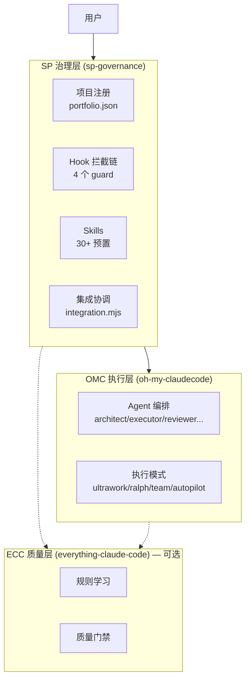
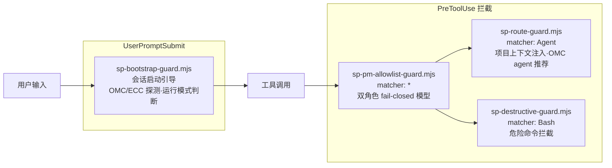
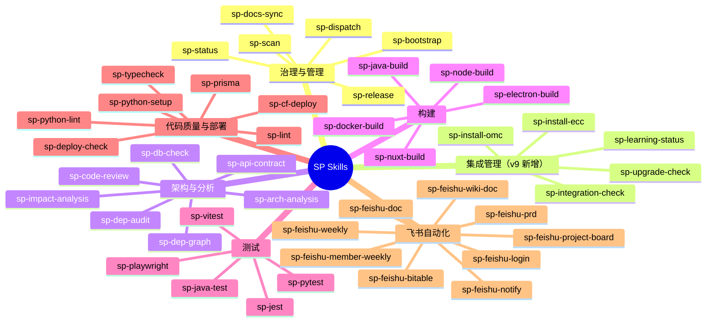
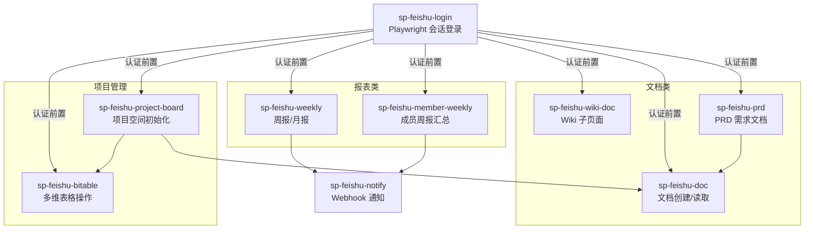

# SP Governance v9.0.0 — 能力与技能全景图

> 基于项目实际文件和配置生成，反映 sp-governance 插件的真实能力状态。
>
> 生成日期: 2026-04-20

---

## 一、三层架构总览



### 运行模式

| 模式 | 条件 | 说明 |
|------|------|------|
| `full` | SP + OMC + ECC 均可用 | 三层完整协作 |
| `sp-omc` | SP + OMC 可用 | SP 治理 + OMC 执行（推荐） |
| `sp-ecc` | SP + ECC 可用 | SP 治理 + ECC 质量 |
| `sp-only` | 仅 SP 可用 | 纯治理模式 |

---

## 二、Agent 体系（OMC 统一）

v9 废弃所有 `sp-governance:sp-*` agents，统一使用 OMC agents：

| 任务 | OMC Agent | 原 SP Agent（已废弃） |
|------|-----------|---------------------|
| 架构分析 | `oh-my-claudecode:architect` | sp-architect, sp-cross-architect |
| 代码实现 | `oh-my-claudecode:executor` | sp-coder |
| 代码审查 | `oh-my-claudecode:code-reviewer` | sp-reviewer, sp-cross-reviewer |
| 测试编写 | `oh-my-claudecode:test-engineer` | sp-tester |
| 文档编写 | `oh-my-claudecode:writer` | sp-doc-engineer |
| 安全审查 | `oh-my-claudecode:security-reviewer` | — |
| 调试分析 | `oh-my-claudecode:debugger` | — |
| 代码搜索 | `oh-my-claudecode:explore` | — |
| 方案规划 | `oh-my-claudecode:planner` | sp-team-lead, sp-group-lead |

旧 agent 定义归档于 `agents/_archived/`。

---

## 三、Hook 拦截链



| Hook | 触发 | Matcher | 功能 |
|------|------|---------|------|
| `sp-bootstrap-guard` | UserPromptSubmit | `*` | 引导检查、OMC/ECC 探测、运行模式判断 |
| `sp-pm-allowlist-guard` | PreToolUse | `*` | 双角色 fail-closed allowlist |
| `sp-route-guard` | PreToolUse | `Agent` | 项目上下文注入、OMC agent 推荐 |
| `sp-destructive-guard` | PreToolUse | `Bash` | 危险命令拦截 |

---

## 四、Skill 分类全景图



### v9 新增 Skill

| Skill | 说明 |
|-------|------|
| `sp-install-omc` | 安装/配置 OMC 集成 |
| `sp-install-ecc` | 安装/配置 ECC 集成 |
| `sp-integration-check` | 检查三层集成状态和兼容性 |
| `sp-learning-status` | 查看 ECC learning bridge 状态 |
| `sp-upgrade-check` | 检查 SP/OMC/ECC 版本兼容性 |

---

## 五、飞书自动化



依赖: playwright, marked, turndown | 认证: `<workspace>/auth/`

---

## 六、OMC 执行模式整合

| 任务特征 | OMC 模式 | 说明 |
|----------|----------|------|
| ≥3 独立子任务并行 | `/ultrawork` | 高吞吐并行执行 |
| 迭代直到完成 | `/ralph` | 持久循环 + 验证 |
| 端到端自主执行 | `/autopilot` | 全流程自主 |
| 多 agent 协作 | `/team` | N 个协调 agent |
| QA 循环验证 | `/ultraqa` | 测试-修复循环 |
| 复杂 bug 定位 | `/trace` | 证据驱动追踪 |
| 需求模糊需先澄清 | `/ralplan` | 共识规划 |
| 多模型交叉验证 | `/ccg` | Claude+Codex+Gemini |

---

## 七、目录结构

```
sp-governance/
├── CLAUDE.md                   # 治理规则
├── CHANGELOG.md                # 变更记录
├── MIGRATION.md                # 迁移指南
├── agents/_archived/           # v7 agent 定义存档（9 个）
├── governance/                 # 治理规则参考
├── hooks/hooks.json            # 4 个 Hook 定义
├── scripts/
│   ├── sp-bootstrap-guard.mjs
│   ├── sp-pm-allowlist-guard.mjs
│   ├── sp-route-guard.mjs
│   ├── sp-destructive-guard.mjs
│   ├── adapters/               # 适配层（v9 新增）
│   ├── lib/integration.mjs     # 集成状态核心库（v9 新增）
│   └── lib/feishu/             # 飞书共享库
├── skills/                     # 30+ 预置 skill
├── templates/                  # 项目配置模板
├── docs/
│   ├── three-layer-architecture.md  # 三层架构文档
│   ├── global-claude-snippet.md
│   └── sp-capability-map.md    # 本文档
└── .claude-plugin/plugin.json  # 插件元数据
```
